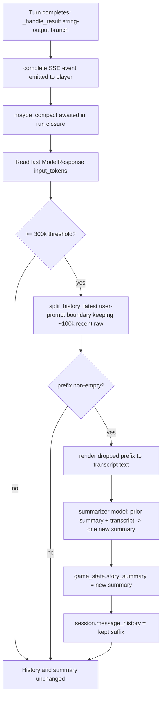

# Transcript Compaction - Plan

## Goal Capsule

- Objective: Bound the GM agent's context growth over a long session by folding old transcript turns into a running narrative summary, so play can continue indefinitely without exhausting the model window.
- Product authority: bilunsun — decisions confirmed in brainstorm.
- Execution profile: Standard depth, 5 implementation units, backend-only (Python). No user-facing UI change.
- Open blockers: none.

---

## Product Contract

Product Contract preservation: unchanged — planning added the Planning Contract and Implementation Units without altering any R-ID.

### Summary

When a turn's context crosses a token threshold, a separate cheaper model compresses the oldest transcript turns into a single running "story so far" summary. The raw turns are then dropped, and only that summary plus a recent raw window remain in context, with the summary injected into the agent's instructions block next to the live game state.

### Problem Frame

The GM agent already offloads mechanical memory: `GameState` (HP, inventory, conditions, enemies, countdowns) is re-injected every turn and never rides on the transcript. Campaign sections are also small and loaded on demand. What grows without bound is the conversation transcript itself — every narration, dialogue line, roll, and tool exchange accumulates because message history is carried forward whole. Over a long session it will dwarf everything else and eventually exceed the model window. Nothing today summarizes, windows, or trims it. This is the one context source with no ceiling.

### Key Decisions

- Recursive single-block summary. Each compaction produces one bounded summary that replaces the prior one. Chosen over segmented or tiered because compaction is infrequent on a large-window model and `GameState` holds the hard facts, so narrative fade is tolerable. Tiered is the upgrade path if campaigns later chain across days.
- Separate, cheaper summarizer model. The task is narrative compression, not GM reasoning, so it runs on an independently configurable model to control cost.
- Recent window sized by tokens, not a turn count. A "turn" here wraps tool calls and deferred dice-roll round-trips; a token budget cut at clean turn boundaries is structurally safer than counting turns.
- Trigger from reported usage, not a local estimator. The provider returns per-request input-token counts, so no separate token counter is needed. The consequence is that compaction fires just after a turn crosses the threshold, which the ceiling headroom absorbs.
- Summary lives in the instructions block, not message history. This mirrors how game state is already injected, keeps the summary swappable, and keeps it out of the persisted transcript it is meant to replace.

### Requirements

**Trigger and budget**

- R1. Context size is measured by the input-token count the model provider reports for the most recent completed turn.
- R2. When that count reaches the compaction threshold (default 300k), a compaction runs before the next turn begins. The hard ceiling is 400k.
- R3. Compaction runs only at a settled turn boundary — never mid-turn and never between a dice-roll request and its returned result.

**Summary generation**

- R4. Compaction targets the oldest turns — everything outside the recent raw window — and compresses them into the running summary.
- R5. The summary is recursive: each compaction feeds the current summary plus the newly-aged-out turns to the summarizer and replaces the summary with the single new result.
- R6. The summary captures narrative continuity only — events, choices made, NPC dispositions, and unresolved threads — not mechanical state, which the game state already carries.
- R7. Summarization uses a separate model from the GM, independently configurable, with a context window large enough to ingest the aged-out turns in one pass.

**Context assembly**

- R8. After compaction, the transcript retains only a recent raw window (default ~100k tokens), cut at clean turn boundaries so the message structure stays valid.
- R9. Whenever a summary exists, it is injected into the agent's instructions block alongside the current game state.
- R10. Before the first compaction, behavior is unchanged: no summary block appears and the full transcript is used.

### Acceptance Examples

- AE1. Covers R1, R2. **Given** the prior turn reported 250k input tokens, **when** the next turn ends at 305k, **then** a compaction runs before the following turn starts.
- AE2. Covers R3. **Given** a turn is paused awaiting a player dice roll, **when** the roll resumes and the turn completes above the threshold, **then** compaction runs after the turn settles — not between the roll request and its result.
- AE3. Covers R5. **Given** a summary already exists from an earlier compaction, **when** a second compaction runs, **then** the summarizer receives the existing summary plus the newly-aged-out turns and returns one replacement summary, not a second appended block.
- AE4. Covers R9, R10. **Given** no compaction has occurred, **then** the instructions carry no story-so-far block; **given** one has occurred, **then** the block appears in the instructions next to game state.

### Scope Boundaries

Deferred for later:

- Vector / RAG retrieval over dropped turns for verbatim recall of distant events.
- Cross-session or multi-day memory persistence.
- Tiered or segmented summary structure.
- Reusing the GM's end-of-turn private-notes string as the memory channel — considered and rejected.
- Compacting or summarizing the game state itself; it is already compact and re-injected each turn.

Deferred to follow-up work:

- Compaction for the CLI entry points (`backend/cli.py`, `backend/daggerheart_main.py`), which manage their own local history lists. This plan wires the API turn engine only. A shared helper makes later CLI adoption a small follow-up.

### Dependencies / Assumptions

- The fixed 300k/400k thresholds assume the active model's context window is at least 400k. The default (glm-5.2, ~1M) satisfies this; switching to a ~200k-window preset requires lowering both thresholds.
- The model provider returns per-request input-token usage (OpenRouter does; surfaced on each `ModelResponse.usage`).
- The summarizer model's window can hold the aged-out turns (up to ~200k) in a single pass.

---

## Planning Contract

### Key Technical Decisions

- KTD1. Measure context size from the last `ModelResponse`'s request usage, not `result.usage()`. Rationale: `RunUsage.input_tokens` sums input across every model request in a turn, and a turn with tool-call round-trips re-sends the full context each time, over-counting several-fold. The final `ModelResponse.usage.input_tokens` is the actual size of the context that carries into the next turn. Satisfies R1.
- KTD2. Compaction is invoked only from the turn-completion path in `backend/api/turn_engine.py` — after `_handle_result` takes its string-output branch (turn done), inside the async `run()` closures where it can await the summarizer. Rationale: both entry paths (`stream_turn`, `stream_deferred_response`) settle a completed turn through this one chokepoint; the `DeferredToolRequests` branch is a paused roll, so gating on the string branch naturally satisfies R3. Running after the `complete` SSE event is emitted keeps compaction latency off the player-visible response. Satisfies R2, R3.
- KTD3. The running summary lives on `GameState` (`story_summary`); the raw transcript stays on `Session.message_history`. Rationale: the `@gm_agent.instructions` functions read `ctx.deps` (a `GameState`), so an injectable summary must live there, exactly like `loaded_sections`. Both are per-session and travel together because `session.game_state` is the run's deps. Satisfies R9.
- KTD4. Slice `message_history` only at a `ModelRequest` carrying a `UserPromptPart`. Rationale: that message is the clean start of a turn, so keeping the suffix from there never orphans a tool-call/tool-return pair and leaves the pydantic-ai message structure valid. Satisfies R8.
- KTD5. Summarization runs on a dedicated pydantic-ai `Agent` whose model comes from `MODEL_PRESETS[os.getenv("SUMMARY_MODEL_PRESET", <cheap default>)]`, mirroring the existing `MODEL_PRESET` pattern. Default to a cheap, large-context preset (e.g. `gemini-flash-lite`) so it can ingest ~200k of aged-out turns in one pass. Satisfies R7.
- KTD6. Recursive summary is built from a plain-text transcript render of the dropped turns, not by feeding raw GM `ModelMessage`s (with their tool-call plumbing) into the summarizer. Extract player prompts, `narrate()` text, and roll outcomes; concatenate with the prior summary; return one replacement block. Satisfies R4, R5, R6.
- KTD7. The recent-window size (~100k) is computed from a per-message token estimate (serialized length ÷ 4) walked back from the end and snapped to the nearest turn boundary. Rationale: pydantic-ai reports usage per request, not per stored message, so exact per-message counts are unavailable; precision is unnecessary given ~200k of headroom between the 100k window and the 300k trigger. Satisfies R8.

### High-Level Technical Design

The compaction pipeline hangs off the existing turn-completion path. It changes nothing about how a turn runs or how narration reaches the player; it only rewrites the stored context after the player-visible response is sent.

New modules: `backend/agent/compaction.py` (measurement, slicing, orchestration entry) and `backend/agent/summarizer.py` (summarizer agent + transcript render). Touched: `backend/game/models.py`, `backend/agent/definition.py`, `backend/api/turn_engine.py`.

---

## Implementation Units

### U1. Story-summary state and instruction injection

- Goal: Hold the running summary on `GameState` and inject it into the agent context when present.
- Requirements: R6, R9, R10.
- Dependencies: none.
- Files: `backend/game/models.py` (add field), `backend/agent/definition.py` (new instructions function), `backend/tests/test_story_summary.py` (new).
- Approach: Add `story_summary: str | None = None` to `GameState`, near `loaded_sections`. Add a new `@gm_agent.instructions` function (`story_so_far`) that returns `<story_so_far>\n{summary}\n</story_so_far>` when `ctx.deps.story_summary` is set, and `""` otherwise. Register it alongside the other instruction functions.
- Patterns to follow: `add_campaign` and `current_game_state` in `backend/agent/definition.py` — XML-tagged blocks derived from `ctx.deps`.
- Test scenarios:
  - Covers AE4. Given `story_summary` is `None`, the function returns an empty string (no `<story_so_far>` block).
  - Covers AE4, R9. Given `story_summary` is set, the returned string wraps the summary text in the `<story_so_far>` tag.
  - Given a set summary, the block contains only narrative text passed in — the function does not read or duplicate mechanical state (R6 boundary).
- Verification: `test_story_summary.py` asserts both the empty and populated outputs of the instruction function.

### U2. Context-size measurement and thresholds

- Goal: Determine current context size from a completed run and expose configurable thresholds.
- Requirements: R1, R2.
- Dependencies: none.
- Files: `backend/agent/compaction.py` (new), `backend/tests/test_compaction.py` (new).
- Approach: `context_input_tokens(result) -> int | None` scans `result.all_messages()` for the last `ModelResponse` and returns its `.usage.input_tokens`; returns `None` if no response carries usage. Read `COMPACT_THRESHOLD` (default `300_000`), `MAX_BUDGET` (default `400_000`), and `RECENT_WINDOW_TOKENS` (default `100_000`) from `os.getenv`, mirroring the `MODEL_PRESET` read in `definition.py`. `should_compact(token_count) -> bool` is `token_count is not None and token_count >= COMPACT_THRESHOLD`.
- Patterns to follow: `os.getenv("MODEL_PRESET", DEFAULT_MODEL)` in `backend/agent/definition.py`.
- Test scenarios:
  - Covers R1. Given a constructed message list whose last `ModelResponse` reports 305k input tokens, `context_input_tokens` returns `305000`.
  - Covers R2. `should_compact(305000)` is `True`; `should_compact(250000)` is `False`.
  - Given a message list with no usage-bearing response, `context_input_tokens` returns `None` and `should_compact(None)` is `False` (safe no-op).
- Verification: `test_compaction.py` unit tests over hand-built message lists.

### U3. Transcript slicing at turn boundaries

- Goal: Split `message_history` into a prefix to summarize and a recent suffix to keep, cutting only at valid turn boundaries within the window budget.
- Requirements: R8.
- Dependencies: U2 (shares config and estimate helper).
- Files: `backend/agent/compaction.py`, `backend/tests/test_compaction.py`.
- Approach: `split_history(messages, recent_window_tokens) -> tuple[list, list]`. Compute boundary indices — `ModelRequest` messages containing a `UserPromptPart`. Walk backward from the end summing an estimated per-message size (serialize parts to text, `len // 4`) until it reaches `recent_window_tokens`; snap the cut to the latest boundary at or before that point. Return `(prefix, suffix)`. If no boundary qualifies or the prefix would be empty (e.g. a single turn already exceeds the window), return `([], messages)` — a no-op rather than an invalid slice.
- Patterns to follow: part iteration over `ModelRequest.parts` / `ModelResponse.parts` as in `backend/api/turn_engine.py` and `backend/agent/runner.py`.
- Test scenarios:
  - Covers R8. Given a history spanning several turns above the window, `split_history` returns a non-empty prefix and a suffix whose first element is a `ModelRequest` with a `UserPromptPart`.
  - Given the result, `prefix + suffix == messages` (no messages lost or duplicated) and the cut never lands between a tool-call response and its tool-return request.
  - Given a history smaller than the window, the prefix is empty (no-op).
  - Given a single turn larger than the window, the prefix is empty (cannot cut below one turn).
- Verification: `test_compaction.py` asserts boundary type of `suffix[0]` and the partition invariant.

### U4. Summarizer agent and recursive summary

- Goal: Produce the new running summary from the prior summary plus the aged-out turns, using a separate cheap model.
- Requirements: R4, R5, R6, R7.
- Dependencies: U3 (provides the prefix).
- Files: `backend/agent/summarizer.py` (new), `backend/tests/test_summarizer.py` (new).
- Approach: Build a dedicated `Agent` with `output_type=str`, model resolved from `MODEL_PRESETS[os.getenv("SUMMARY_MODEL_PRESET", <cheap default>)]`. `render_transcript(prefix_messages) -> str` extracts readable content — player `UserPromptPart` text, `narrate()` argument text, and roll/tool outcomes — and omits raw tool-call plumbing. `async summarize(prior_summary, prefix_messages) -> str` calls the summarizer with an instruction to update the running "story so far": capture events, decisions, NPC dispositions, and unresolved threads; narrative only; omit mechanical stats (tracked separately in game state); return the full replacement summary with the prior summary folded in.
- Patterns to follow: `Agent(f"openrouter:{MODEL_NAME}", ...)` construction and `MODEL_PRESETS` in `backend/agent/definition.py`.
- Test scenarios:
  - Covers R4, R6. Given a batch of aged-out turns, `render_transcript` output includes player messages and `narrate()` text and excludes raw tool-call argument JSON.
  - Covers R7. Given a `SUMMARY_MODEL_PRESET` env override, the summarizer agent is constructed with that preset's model id.
  - Covers R5. Given a prior summary and a prefix, `summarize` (with the model call stubbed) passes both the prior summary and the rendered transcript into a single request and returns one string — no appended second block.
  - Smoke (network, non-blocking in CI): a live `summarize` call returns non-empty narrative prose. Mark as an integration/smoke check, not an asserted-content unit test.
- Verification: `test_summarizer.py` unit-tests `render_transcript` and model selection with the model call stubbed; the live smoke check is run manually.
- Execution note: Stub the summarizer's model in unit tests for determinism; keep the live call to a separate smoke check.

### U5. Compaction orchestration in the turn-completion path

- Goal: On a completed turn over threshold, run the compaction pipeline and update session and game state.
- Requirements: R2, R3, R5, R8, R9.
- Dependencies: U1, U2, U3, U4.
- Files: `backend/agent/compaction.py` (orchestration entry), `backend/api/turn_engine.py` (wire-in), `backend/tests/test_compaction_integration.py` (new).
- Approach: Add `async maybe_compact(session, result) -> None` to `compaction.py`: measure context (U2); if `should_compact`, `split_history` (U3); if the prefix is non-empty, `summarize` (U4) folding `session.game_state.story_summary`, then set `session.game_state.story_summary` to the new summary and `session.message_history` to the suffix; log the compaction. In `backend/api/turn_engine.py`, call `await maybe_compact(session, result)` from the async `run()` closures in both `stream_turn` and `stream_deferred_response`, after `_handle_result` returns and after the `complete` event is queued, and only when the result took the string-output (turn-complete) branch — never the `DeferredToolRequests` branch.
- Patterns to follow: the async `run()` closures and `logger` usage in `backend/api/turn_engine.py`.
- Test scenarios:
  - Covers R2. Given a completed turn whose measured context is below threshold, `maybe_compact` leaves `message_history` and `story_summary` unchanged.
  - Covers R8, R9. Given a completed turn at/above threshold with a summarizable prefix (summarizer stubbed), `message_history` becomes the suffix and `game_state.story_summary` is set.
  - Covers R5, AE3. Given an existing `story_summary`, a second compaction passes it into the summarizer and replaces it rather than appending.
  - Covers R3. Given a result on the `DeferredToolRequests` branch (awaiting a roll), `maybe_compact` makes no changes / is not invoked.
  - Covers R3, AE2. Given a roll-resume turn that completes over threshold, compaction runs after the turn settles.
- Verification: `test_compaction_integration.py` drives `maybe_compact` with a fake result crossing the threshold and asserts the session state transitions and the deferred-branch no-op.
- Execution note: End-to-end, verify the next run's assembled instructions contain the `<story_so_far>` block and the trimmed history.

---

## Verification Contract

| Check | Command | Applies to |
|---|---|---|
| Unit + integration tests | `backend/.venv/bin/python -m pytest backend/tests/` | U1–U5 |
| New-module tests only | `backend/.venv/bin/python -m pytest backend/tests/test_compaction.py backend/tests/test_summarizer.py backend/tests/test_compaction_integration.py backend/tests/test_story_summary.py` | U1–U5 |
| Existing suite still green | `backend/.venv/bin/python -m pytest` | regression |
| Summarizer live smoke | manual `summarize` call against the configured `SUMMARY_MODEL_PRESET` | U4 |

Test scenarios use hand-built `ModelMessage` lists and a stubbed summarizer model; only the live smoke check makes a network call.

## Definition of Done

- `GameState.story_summary` exists and the `story_so_far` instruction function injects it only when set (U1).
- Context size is read from the last `ModelResponse.usage.input_tokens`, and thresholds/window are env-configurable with the documented defaults (U2).
- `split_history` partitions the transcript at a user-prompt boundary within the window budget, with a safe no-op when it cannot (U3).
- A separate, env-configurable summarizer produces one recursive replacement summary from the prior summary plus a plain-text render of the dropped turns (U4).
- `maybe_compact` runs only on completed turns over threshold, updates `session.message_history` and `game_state.story_summary`, and never fires on the deferred-roll branch (U5).
- All new tests pass and the existing suite stays green.
