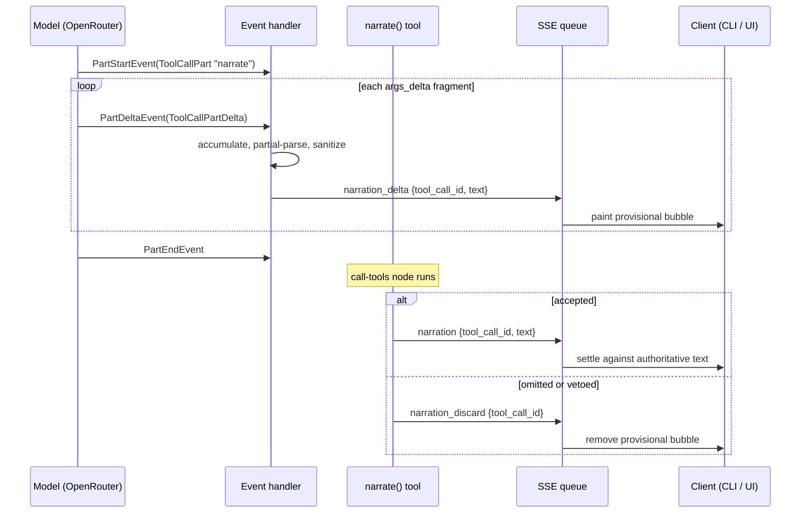
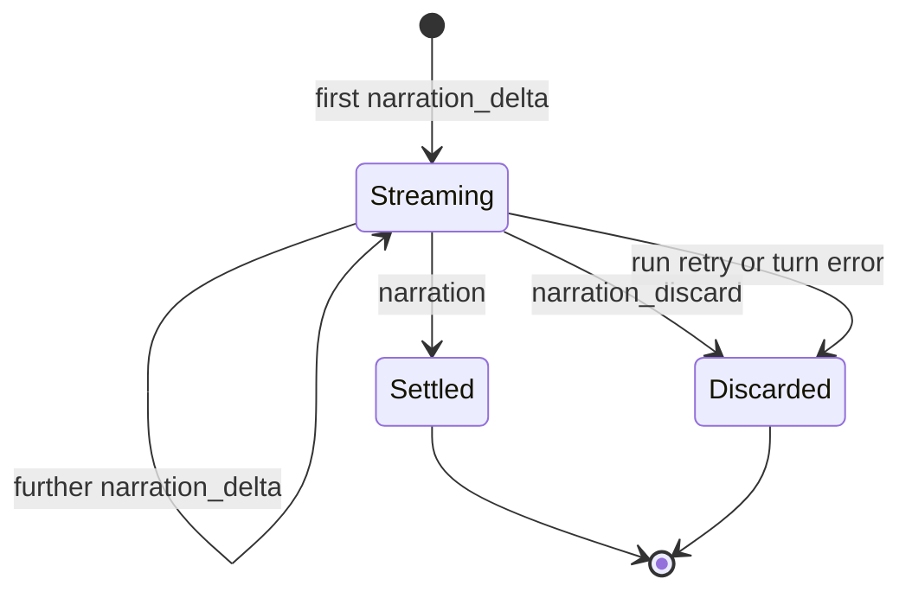

# Narration Token Streaming - Plan

## Goal Capsule

- Objective: Show GM narration to the player as the model writes it, instead of after the whole turn resolves. Measured on `z-ai/glm-5.2`, this replaces roughly 9 seconds of a 14-second dead-air wait with text that flows.
- Product authority: bilunsun — scope confirmed before planning.
- Execution profile: Standard depth, 6 implementation units. Backend and CLI land and are verified first; frontend rendering follows.
- Open blockers: none.

---

## Product Contract

### Summary

The player-visible channel is the `text` argument of a `narrate()` tool call, not model output text. The backend reads that argument incrementally as the model emits it, partial-parses the `text` field out of the in-flight JSON, and pushes it over the existing SSE queue as a new event. The CLI and the web client render a provisional bubble that fills in, then settle it against the authoritative text when the tool actually executes.

### Problem Frame

A turn currently takes about 14 seconds and shows nothing until it is over. The player sends a message, watches a static "GM is thinking…" label, and then the entire narration appears at once. This is the dominant complaint about the app's feel.

The transport is not the bottleneck — SSE already streams `thinking`, `scene`, `state_changed`, and `pending_action` events mid-turn. The bottleneck is that `narrate()` (`backend/agent/tools.py:53-79`) pushes its text onto the queue only when the tool executes, which happens after the model has finished writing the entire tool call. The tokens exist well before the tool runs; nothing reads them.

An empirical probe (`backend/check_stream_granularity.py`) confirmed the tokens are available at useful granularity: `z-ai/glm-5.2` fragments `narrate` arguments into 80 distinct visible reveals across 83 chunks over 3.44 seconds, with lossless partial-JSON reconstruction. First visible token lands at 5.11s against a 14.0s total.

### Requirements

**Streaming behavior**

- R1. The `text` argument of `narrate()` reaches the client incrementally while the model is still writing it.
- R2. Only `narrate()` is streamed. No other tool's arguments are read for display, and no other tool changes behavior.
- R3. Both turn paths stream: the fresh player-message turn and the resume-after-dice-roll turn.
- R4. A turn containing several `narrate()` calls streams each one independently, correlated by tool call id.

**Reconciliation**

- R5. `extract_leaked_ask_player_roll` runs on every partial text, so leaked tool markup never reaches the player even momentarily.
- R6. When `narrate()` accepts the text, the provisional display is settled against the authoritative sanitized text the tool recorded.
- R7. When `narrate()` drops the text (roll-prompt-only narration) or rejects it (`ModelRetry` while a damage roll is outstanding), the provisional display is removed rather than left standing.

**Developer tooling**

- R8. Thinking output stays out of the player's view and is available behind the existing dev-only debug console.
- R9. The CLI renders streamed narration as flowing text and can emit the raw event sequence for programmatic assertion.

**Sequencing and compatibility**

- R10. Backend and CLI changes are verified through the CLI's real SSE path before frontend rendering work begins.
- R11. A model or provider that emits `narrate` arguments in one chunk degrades to today's behavior — one reveal, then settle — with no error.

### Scope Boundaries

- The roughly 5.1 seconds before narration begins (model thinking plus a `set_scene()` round trip) is not addressed. The player continues to see the static "GM is thinking…" label for that window.
- Streaming any tool other than `narrate()` is out.
- Switching model presets, or adding a client-side typewriter fallback for providers that return arguments atomically, is out. The probe exists to detect that case if a preset changes.
- Thinking text is never shown to the player by default; the dev toggle is a developer affordance only.

#### Deferred to Follow-Up Work

- `GET /sessions/{id}/messages` (`backend/app.py:115-136`) rebuilds GM turns by reading `part_kind == "text"` parts, but narration lives in tool calls. Narration likely does not survive a session resume today. Pre-existing and unrelated to streaming, but adjacent enough to note.

### Acceptance Examples

- AE1. Normal narration
  - **Given:** the model calls `narrate()` with four sentences and the tool accepts them.
  - **When:** the turn runs.
  - **Then:** text appears progressively in one bubble, and the final settled text equals what `narrate()` recorded.
- AE2. Leaked markup
  - **Given:** the model embeds `ask_player_roll` markup inside the narration text.
  - **When:** the partial containing that markup arrives.
  - **Then:** the markup is never displayed, and the existing leaked-roll recovery still produces a roll prompt.
- AE3. Damage-roll veto
  - **Given:** `awaiting_damage_roll` is set and the model calls `narrate()` before rolling damage.
  - **When:** the tool raises `ModelRetry`.
  - **Then:** the provisional bubble is removed, and the model's retried narration streams into a new bubble.
- AE4. Roll-prompt-only narration
  - **Given:** the narration text is nothing but leaked roll markup, so the sanitized text is empty.
  - **When:** `narrate()` returns "Narration omitted".
  - **Then:** the provisional bubble is removed and no empty bubble remains.
- AE5. Atomic provider
  - **Given:** a provider returns the whole `narrate` argument blob in one chunk.
  - **When:** the turn runs.
  - **Then:** one reveal fires, the bubble settles normally, and nothing errors.

---

## Planning Contract

### Key Technical Decisions

- KTD1. Read deltas at the model-request node, settle at the call-tools node. `ToolCallPartDelta.args_delta` arrives while the model writes; `narrate()` runs later and holds the sanitize and veto logic. The gap between the two is the reason R6 and R7 exist, and it cannot be closed by reordering — it is inherent to a tool-argument-carried display channel.

  *Rejected alternative:* make narration the model's plain text output so it streams natively as `TextPartDelta`, moving private notes to an explicit end-of-turn tool. This removes partial-JSON parsing, the reconciliation problem, and any dependence on provider argument fragmentation. It lost on two grounds. The prompt spine in `backend/agent/definition.py:71` ("You act through tool calls… The player sees ONLY the text you pass to narrate()") is load-bearing across the whole instruction set, and inverting it means models leak stray reasoning into the player-visible channel. And the probe showed fragmentation is not the fragile path here — 80 clean reveals on the default preset removed the main argument for the rewrite. Revisit only if the probe starts reporting `ATOMIC` across presets.

- KTD2. Delta events carry the cumulative sanitized text, not the raw JSON fragment. Cumulative payloads are idempotent and self-healing: a client that misses or reorders a frame still converges. Raw fragments would push partial-JSON parsing and sanitization into every client, including the CLI. Cost is roughly 25 KB per narration instead of 700 bytes, which is irrelevant on a local SSE stream.

- KTD3. `narrate()` emits its own settle and discard events, correlated by `RunContext.tool_call_id`. All three outcomes — accepted, omitted, vetoed — are decided inside the tool body, so the tool is the only place that knows which fired. This avoids inferring outcomes from `FunctionToolResultEvent` shapes in the handler. The existing `narration` event gains a `tool_call_id` field and becomes the settle signal.

- KTD4. Thinking is accumulated from `ThinkingPartDelta` and emitted whole on `PartEndEvent`. Sourcing thinking from the model-request node is what lets `is_first_call_tools_node` (`backend/agent/runner.py:38`) be deleted — that node only ever streams fresh responses, so the deferred-resume replay bug the flag guards against cannot occur. Emitting on part end rather than per delta preserves today's one-event-per-thinking-block contract, keeping console logs readable and U6 simple.

- KTD5. The accumulator is a pure module with no agent or network dependency. Everything else in this plan needs a live model to exercise; the parsing and sanitizing logic is where the real defects live, so it is isolated behind a plain function boundary and unit-tested directly. Mirrors `backend/api/narration_sanitize.py` and its test.

- KTD6. The live bubble is a flag on the existing `message` transcript entry, not a new entry kind. `TranscriptEntry` (`frontend/src/lib/play/transcript.ts:48-71`) already carries optional per-entry flags (`ooc`, `error`); a `streaming` flag follows that shape and keeps every existing consumer working unchanged.

- KTD7. The dev thinking display extends the existing debug console rather than adding a new surface. `frontend/src/lib/play/devDebugConsole.ts` already defines a typed action registry with `isDev` gating, `localStorage` persistence, and wiring through `SessionLayout.tsx:397` and `SessionMenu.tsx:90`. Adding a thinking toggle there costs one registry entry and a render branch.

### High-Level Technical Design

Timing across the two graph nodes — the source of the reconciliation requirement:

Provisional bubble lifecycle, as the client must model it:

### Sequencing

U1 and U2 are independent and can land in either order. U3 depends on both. U4 proves U3 through the CLI and gates U5 — do not start frontend rendering until the CLI shows narration flowing and the JSON event sequence asserts clean. U6 is independent of the streaming chain and can land at any point.

---

## Implementation Units

### U1. Narration delta accumulator

- **Goal:** A pure module that turns a sequence of `args_delta` fragments into a sequence of sanitized, cumulative, player-safe text reveals.
- **Requirements:** R1, R4, R5, R11
- **Dependencies:** none
- **Files:**
  - `backend/agent/narration_stream.py` (create)
  - `backend/tests/test_narration_stream.py` (create)
- **Approach:** Keep per-tool-call state keyed by tool call id: the raw args buffer and the last emitted text. On each fragment, append to the buffer, parse with `pydantic_core.from_json(buf, allow_partial='trailing-strings')`, pull `text`, run `extract_leaked_ask_player_roll` on it, and emit only when the sanitized result differs from the last emission. Handle `args_delta` arriving as a `dict` rather than a `str` (some providers do this) by treating it as a single complete payload. Fragments that leave the buffer unparseable yield nothing rather than raising.
- **Patterns to follow:** `backend/api/narration_sanitize.py` — small pure module, single responsibility, tested directly. `backend/check_stream_granularity.py` already contains a working reference implementation of the partial-parse and reveal-diffing logic.
- **Execution note:** Write this test-first. It is the only unit in the plan that can be fully proven without a live model, and it holds the logic most likely to be subtly wrong.
- **Test scenarios:**
  - Covers AE1. Fragments spelling `{"text":"The iron box..."}` produce strictly growing reveals whose final value equals the full text.
  - A fragment that splits mid-key (`{"te` then `xt":"..."`) produces no reveal until `text` is parseable.
  - Covers AE5. A single fragment carrying the entire complete JSON blob produces exactly one reveal.
  - Covers AE2. Fragments that assemble embedded `ask_player_roll` markup never emit a reveal containing that markup, at any intermediate point.
  - Two interleaved tool call ids accumulate independently and do not cross-contaminate.
  - `args_delta` supplied as a `dict` produces one reveal.
  - A buffer that never becomes valid JSON produces zero reveals and raises nothing.
  - Consecutive identical parses emit one reveal, not two.
- **Verification:** `uv run pytest tests/test_narration_stream.py` passes; no import of `pydantic_ai.Agent` or network access in the module.

### U2. Event-stream handler refactor in the runner

- **Goal:** Replace the manual node walk with `gm_agent.run(event_stream_handler=...)`, sourcing thinking from the model-request node, and delete the deferred-resume workaround.
- **Requirements:** R8 (preserves the thinking channel U6 consumes; the dev-facing display itself lands in U6)
- **Dependencies:** none
- **Files:**
  - `backend/agent/runner.py` (modify)
  - `backend/api/turn_engine.py` (modify — caller signature)
  - `backend/cli.py` (modify — caller signature)
  - `backend/tests/test_runner_events.py` (create)
- **Approach:** `run_agent_iter` keeps its retry loop and its return contract (callers still inspect `result.output` for `DeferredToolRequests` versus `str`), but its body becomes a `run()` call with a handler. pydantic-ai runs the same `iter()` + `node.stream()` loop internally over both model-request and call-tools nodes. Accumulate `ThinkingPartDelta.content_delta` per part index and emit the completed block on `PartEndEvent`, preserving the current one-callback-per-thinking-block shape. Drop `is_first_call_tools_node` and the `ThinkingPart` import. Rename the parameter from `on_thinking` to a general event callback if that reads better — `backend/cli.py:69-80` and both `turn_engine.py` call sites must move with it.

  Keep the handler body as a plain function over an async iterable of events rather than a closure buried in `run_agent_iter`, so tests can drive it with synthetic event sequences and no live model. U3 extends this same function.
- **Patterns to follow:** `pydantic_ai/agent/abstract.py:259-281` shows the internal loop being replaced.
- **Execution note:** Behavior-preserving. Prove it by running an existing turn through `backend/cli.py` and confirming thinking blocks log exactly as before — same count, same content — including on a turn that resumes after a dice roll.
- **Test scenarios:**
  - Synthetic thinking deltas across one part index produce one callback carrying the concatenated content, fired at `PartEndEvent`, not one callback per delta.
  - Two thinking parts at different indices produce two callbacks, each with its own content.
  - An event sequence with no thinking parts produces no callbacks.
  - Events arriving from a replayed call-tools node produce no thinking callbacks, confirming the deferred-resume duplication that `is_first_call_tools_node` guarded against cannot recur.
  - The transient-error retry path still retries and still surfaces the original exception after exhausting attempts.
  - Existing `backend/tests/test_turn_engine_compaction.py` and `backend/tests/test_compaction_integration.py` pass unchanged — they exercise this call path.
- **Verification:** `uv run pytest` passes with no changes to existing tests; `uv run python cli.py` completes a turn with thinking output identical in shape to before, including on a resume-after-roll turn.

### U3. Narration deltas and settle/discard over SSE

- **Goal:** Emit `narration_delta` while the model writes, and make `narrate()` emit the settle or discard signal that resolves it.
- **Requirements:** R1, R2, R3, R4, R5, R6, R7
- **Dependencies:** U1, U2
- **Files:**
  - `backend/agent/runner.py` (modify)
  - `backend/agent/tools.py` (modify — `narrate`)
  - `backend/api/turn_engine.py` (modify — both stream functions)
  - `backend/tests/test_narration_events.py` (create)
- **Approach:** In the handler, track `PartStartEvent` for `ToolCallPart` and record which part indices belong to `narrate`; ignore every other tool. Feed matching `ToolCallPartDelta` fragments to the U1 accumulator and push `narration_delta {tool_call_id, text}` per reveal. Where a provider leaves `tool_call_id` unset on the delta, fall back to the id captured at part start, keyed by part index.

  In `narrate()`, emit `narration_discard {tool_call_id}` on both early-exit paths — sanitized-empty and the `awaiting_damage_roll` retry — before returning or raising. On the success path, add `tool_call_id` to the existing `narration` payload so it acts as the settle signal. Both `stream_turn` and `stream_deferred_response` get the handler wiring; the queue plumbing already exists. On a whole-run retry inside `run_agent_iter`, discard every open tool call id so text from the failed attempt does not persist.
- **Patterns to follow:** `backend/agent/tools.py:41-50` (`_notify_state_changed`) for the queue-push-if-active idiom, including the `_event_queue is None` no-op that keeps the in-process CLI working.
- **Test scenarios:**
  - Covers AE1. A fake event sequence containing `narrate` deltas produces `narration_delta` events in order, then one `narration` carrying the same tool call id.
  - Covers R2. Deltas belonging to `set_scene` or `ask_player_roll` produce no `narration_delta` events.
  - Covers AE3. With `awaiting_damage_roll` set, `narrate()` pushes `narration_discard` and then raises `ModelRetry`.
  - Covers AE4. Narration that sanitizes to empty pushes `narration_discard` and returns the omitted-narration string.
  - Covers R4. Two `narrate` calls in one turn produce two independent delta streams, each settled by its own id.
  - Covers R3. The resume-after-dice-roll path emits `narration_delta` events, confirming `stream_deferred_response` is wired and that the replayed first tool-call batch does not re-emit narration from the previous response.
  - A whole-run retry discards the open tool call id from the failed attempt.
  - With `_event_queue` unset (in-process CLI), no events are pushed and nothing raises.
- **Verification:** `uv run pytest tests/test_narration_events.py` passes; a live turn against the running server produces `narration_delta` frames before the `narration` frame.

### U4. CLI streaming render and event assertion

- **Goal:** Make the CLI show narration flowing, and give it a machine-checkable view of the event sequence. This unit is the gate for all frontend work.
- **Requirements:** R9, R10
- **Dependencies:** U3
- **Files:**
  - `backend/ui_cli.py` (modify — `render_event`, output helpers)
  - `backend/cli.py` (modify — stream narration to stdout)
  - `backend/tests/test_ui_cli_render.py` (create)
- **Approach:** Add a write helper alongside `out()` (`backend/ui_cli.py:65`) that uses `click.echo(..., nl=False)` and flushes, since `out()` always appends a newline. In `render_event` (`backend/ui_cli.py:466`), handle `narration_delta` by printing only the newly-appended suffix relative to what was already printed for that tool call id — the payload is cumulative, so printing it whole per event would repeat the text 80 times. Settle on `narration` by closing the line; on `narration_discard`, clear the line and note the discard visibly so a veto is not silently invisible during testing. Without this, the existing unknown-event fallback at `backend/ui_cli.py:492` renders one dim JSON line per token.

  In `backend/cli.py`, stream the same text to stdout through the U2 handler. Suppress the existing `logger.info` narration line in `narrate()` (`backend/agent/tools.py:78`) when streaming already printed the text, or it double-prints.
- **Patterns to follow:** `backend/ui_cli.py:466-493` — the existing event-type dispatch; keep the `--json` branch at the top untouched so `--json` continues to dump every event verbatim.
- **Execution note:** This is the verification harness for the backend. Keep the suffix-diffing as a pure function separate from the printing so it can be tested directly — printing cumulative payloads whole is the specific bug this unit exists to avoid, and it is not catchable by eye on a fast stream. Drive the CLI manually before writing U5: send a turn, watch text flow, then re-run with `--json` and confirm the frame sequence.
- **Test scenarios:**
  - Successive cumulative payloads for one tool call id yield only the newly-appended suffix each time, and the concatenation of all suffixes equals the final text.
  - A repeated identical payload yields an empty suffix rather than reprinting.
  - A payload that is shorter than the last seen (a sanitizer rewrite shrinking the text) does not emit a negative or garbled suffix.
  - Two interleaved tool call ids track independent suffix state.
  - A `narration` settle for an id with no prior deltas prints the full text once.
  - Manual: `uv run python ui_cli.py send <sid> "<message>"` shows narration appearing progressively rather than all at once.
  - Manual: `uv run python ui_cli.py --json send <sid> "<message>"` emits multiple `narration_delta` events with monotonically growing `text`, followed by exactly one `narration` sharing the same `tool_call_id`.
  - Manual: a combat turn that triggers the damage-roll veto shows the discard, and the retried narration streams fresh.
  - Manual: `uv run python cli.py` streams narration once, not twice.
- **Verification:** `uv run pytest tests/test_ui_cli_render.py` passes; narration visibly flows in both CLIs; the `--json` frame sequence matches the expected order; `run_turn`'s pending-roll loop still resolves rolls and reaches `complete`.

### U5. Frontend live narration bubble

- **Goal:** Render the streaming bubble in the web client, settling or discarding it per the backend's signals.
- **Requirements:** R1, R4, R6, R7, R11
- **Dependencies:** U3, gated on U4 verification
- **Files:**
  - `frontend/src/api/client.ts` (modify — `TurnEvent` union)
  - `frontend/src/lib/play/transcript.ts` (modify — `streaming` flag on the `message` entry)
  - `frontend/src/lib/play/narrationStream.ts` (create — pure reducer)
  - `frontend/src/lib/play/narrationStream.test.ts` (create)
  - `frontend/src/hooks/useChat.ts` (modify — `processTurnStream` cases)
  - `frontend/src/components/play/StoryStack.tsx` (modify — streaming affordance)
- **Approach:** Extend `TurnEvent` (`frontend/src/api/client.ts:84`) with `narration_delta` and `narration_discard`, and add `tool_call_id` to `narration`. Put the transcript-mutation logic in a pure reducer under `lib/play/` — upsert a streaming entry by tool call id, settle it by replacing content and clearing the flag, discard it by removing it — so it can be tested without React. `useChat`'s `processTurnStream` (`frontend/src/hooks/useChat.ts:144`) calls the reducer; the existing `narration` case changes from "always append" to "settle if a streaming entry with this id exists, otherwise append", which keeps AE5 and any non-streaming path working. Clear open streaming entries on `error` and on turn end so a dropped stream cannot orphan a bubble. In `StoryStack`, suppress the "GM is thinking…" placeholder (`frontend/src/components/play/StoryStack.tsx:177`) once a streaming entry exists, and give the streaming bubble a cursor or similar in-progress affordance.
- **Patterns to follow:** `frontend/src/lib/play/transcript.ts` for entry shapes and the `markRollPromptRolled` transform; `frontend/src/lib/play/rollResultAdapter.ts` and its colocated test for the pure-logic-plus-test convention.
- **Test scenarios:**
  - Covers AE1. A sequence of deltas followed by a matching `narration` yields exactly one settled entry whose content is the authoritative text.
  - Deltas with no prior entry create a streaming entry; subsequent deltas update it in place rather than appending.
  - Covers AE3 and AE4. `narration_discard` removes the matching streaming entry and leaves the rest of the transcript untouched.
  - Covers AE5. A `narration` with no preceding delta appends a settled entry, as today.
  - Covers R4. Two concurrent tool call ids maintain two separate entries.
  - An `error` event clears any open streaming entry.
  - A `narration_discard` for an unknown id is a no-op.
- **Verification:** `npm test` and `npm run type-check` pass in `frontend/`; a live turn in the browser shows text flowing into one bubble that settles cleanly.

### U6. Dev-only thinking display

- **Goal:** Surface GM thinking in the UI behind the existing developer console, never to the player by default.
- **Requirements:** R8
- **Dependencies:** none
- **Files:**
  - `frontend/src/lib/play/devDebugConsole.ts` (modify — registry entry)
  - `frontend/src/hooks/useChat.ts` (modify — handle the `thinking` event)
  - `frontend/src/components/play/PlayDebugConsole.tsx` (modify — toggle + display)
  - `frontend/src/lib/play/devDebugConsole.test.ts` (modify)
- **Approach:** The backend already emits `thinking` events and `frontend/src/api/client.ts:86` already types them; `useChat` has no case for them, so they are received and dropped. Capture them into dev-only state and render behind a toggle in the existing console, following the established `DevDebugAction` registry shape with its `isDev` gate and `localStorage` persistence. Thinking never enters the player transcript. Console logging already exists server-side via loguru (`backend/api/turn_engine.py:137`) and needs no change.
- **Patterns to follow:** `frontend/src/lib/play/devDebugConsole.ts` (`DEV_DEBUG_ACTIONS`, `DEBUG_CONSOLE_STORAGE_KEY`), and the `isDev` gating at `frontend/src/components/play/SessionLayout.tsx:397` and `frontend/src/components/play/SessionMenu.tsx:90`.
- **Test scenarios:**
  - The thinking toggle appears in the action registry with the correct category and scope.
  - Thinking events are captured into dev state and never appear as transcript entries.
  - With the toggle off, thinking content does not render.
  - Toggle state survives a reload via the existing storage key.
- **Verification:** `npm test` and `npm run type-check` pass; the toggle is absent in a production build (`isDev` false) and functional in dev.

---

## Verification Contract

| Gate | Command | Applies to |
|---|---|---|
| Backend unit tests | `uv run pytest` (from `backend/`) | U1, U2, U3, U4 |
| Provider granularity | `uv run python check_stream_granularity.py z-ai/glm-5.2` | U3 — must report `STREAMABLE` |
| CLI visual proof | `uv run python ui_cli.py send <sid> "<message>"` | U4 — gate for U5 |
| CLI event sequence | `uv run python ui_cli.py --json send <sid> "<message>"` | U4 — gate for U5 |
| In-process CLI | `uv run python cli.py` | U2, U4 |
| Frontend tests | `npm test` (from `frontend/`) | U5, U6 |
| Frontend types | `npm run type-check` (from `frontend/`) | U5, U6 |
| Dependency floor | `backend/pyproject.toml` declares a pydantic-ai floor that actually carries `event_stream_handler`, `PartEndEvent`, and `RunContext.tool_call_id` | U2 |

`backend/check_stream_granularity.py` doubles as a regression guard for preset changes: it exits 0 on `STREAMABLE`, 1 on `MARGINAL`, 2 on `ATOMIC`, 3 on `INCONCLUSIVE`. Run it against any new entry in `MODEL_PRESETS` before switching the default, since an `ATOMIC` provider silently reduces this feature to today's behavior.

---

## Definition of Done

- Every requirement R1 through R11 is satisfied, and each acceptance example AE1 through AE5 is covered by the test scenarios that cite it. AE3 and AE4 are additionally observed once on a live combat turn in the CLI, since their triggers depend on real model behavior.
- All gates in the Verification Contract pass.
- `is_first_call_tools_node` is gone from `backend/agent/runner.py` and no equivalent workaround has been reintroduced elsewhere.
- `backend/pyproject.toml` declares a pydantic-ai floor that actually carries the APIs this work depends on.
- Narration prints exactly once in both CLIs — no double-print from the retained loguru line.
- No orphaned provisional bubbles: a vetoed, omitted, retried, or errored turn leaves no partial text on screen in either client.
- Experimental or dead-end code from approaches that did not work out is removed, not left in the diff.

---

## Risks & Dependencies

- **The declared pydantic-ai floor is below what this plan needs.** `backend/pyproject.toml` declares `pydantic-ai>=1.25.1`, but `run(event_stream_handler=...)`, `PartEndEvent`, and `RunContext.tool_call_id` were verified only against the locked 1.56.0. A fresh resolve near the floor could produce a build where this code does not import. Raise the floor to the version actually depended on as part of U2.

- **Provider fragmentation is a property of the route, not the model.** OpenRouter's upstream providers differ in how they chunk tool-call arguments, and `MODEL_PRESETS` pins provider order for some entries but not others. A preset change, or an OpenRouter routing change on an unpinned preset, can silently downgrade streaming to a single reveal. R11 makes that degrade safely; `check_stream_granularity.py` is how it gets detected. Note that the probe currently reports the served provider as `openrouter` rather than the upstream name, so pinning `--provider` with fallbacks off is the only reliable way to attribute a result.

- **The SSE event contract is consumed by two independent clients.** Adding `tool_call_id` to the existing `narration` payload and introducing `narration_delta` and `narration_discard` changes a shared surface. `backend/ui_cli.py` tolerates unknown events through its fallback branch, and `frontend/src/api/client.ts` will fail type-check on an unhandled union member — so the CLI degrades quietly while the web client fails loudly. Landing U4 before U5 means the CLI is correct first; until U5 lands, the web client shows unchanged behavior rather than breaking, because it ignores event types it does not match.

- **Streaming makes turn-level failures visible that were previously invisible.** Today a mid-turn crash shows nothing, so nothing looks wrong. With streaming, a dropped connection or a run retry can leave half a sentence on screen. The discard-on-error and discard-on-retry paths are load-bearing for perceived reliability, not just correctness.

---

## Sources / Research

- `backend/check_stream_granularity.py` — the probe written for this work. Measured `z-ai/glm-5.2`: 80 reveals across 83 chunks over 3.44s, lossless reconstruction, first token at 5.11s of a 14.0s turn.
- `pydantic_ai/agent/abstract.py:259-281` (installed 1.56.0) — `run(event_stream_handler=...)` performing the `iter()` + `node.stream()` loop that U2 removes from `backend/agent/runner.py`.
- `pydantic_ai/ui/ag_ui/_event_stream.py:199` and `pydantic_ai/ui/vercel_ai/_event_stream.py:207` — pydantic-ai's own adapters translating `ToolCallPartDelta` into `ToolCallArgsEvent` and `input_text_delta`. Prior art that the SSE event shape in U3 mirrors.
- `RunContext.tool_call_id` — confirmed present in 1.56.0; the correlation handle KTD3 depends on.
- [pydantic-ai #3574](https://github.com/pydantic/pydantic-ai/issues/3574) — `run_stream()` with `end_strategy='early'` skips tool calls when text precedes them. Not a risk here: `backend/agent/definition.py:66` sets `end_strategy="exhaustive"`, and this plan stays in the `run()`/`iter()` family rather than `run_stream()`.
- [langchain #35514](https://github.com/langchain-ai/langchain/issues/35514) — tool-call argument fragmentation varies across OpenRouter's upstream providers; some do not fragment at all. The basis for R11 and for keeping the probe as a preset guard.
